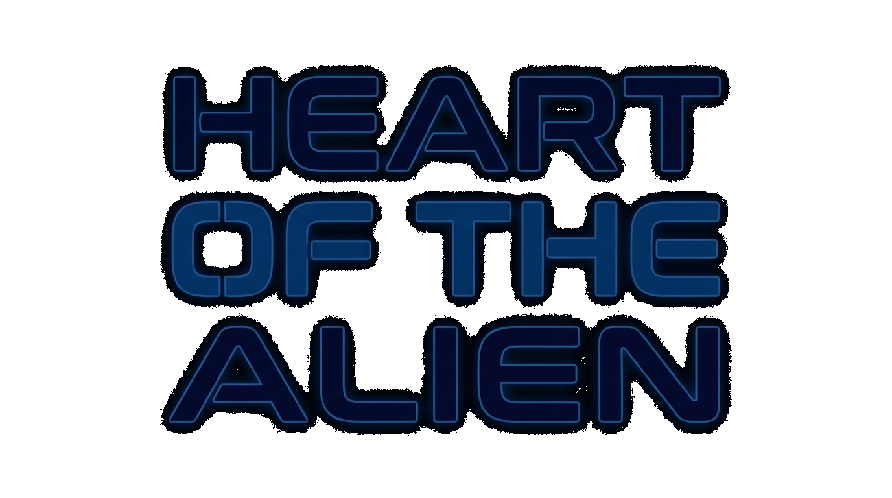
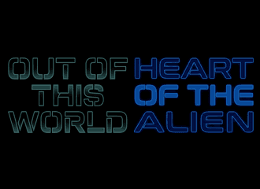
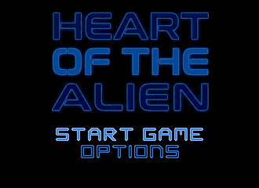
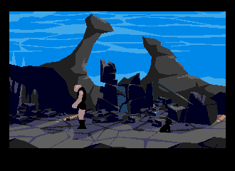
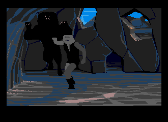
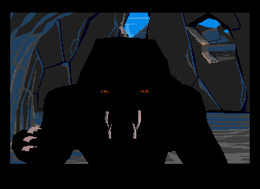
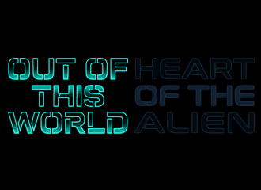

  

# Heart of the Alien for the Sega Saturn

A Sega Saturn port of the Sega CD sequel to Out of this World, <a href='https://en.wikipedia.org/wiki/Heart_of_the_Alien'>Heart of the Alien</a>, with Out of this World on the same disc.

## Table of Contents
1. [Overview](#Overview)
1. [Screenshots](#Screenshots)
1. [About the Game](#About-the-Game)
1. [Setup Instructions](#Setup-Instructions)
1. [Controls](#Controls)
1. [Helpful Game Tips](#Helpful-Game-Tips)
1. [Credits & Special Thanks](#Credits)
1. [Reporting Issues](#Reporting-Issues)
1. [Release Changelog](#Release-Changelog)

## **Overview**

_Out of this World_ ends with Lester passed out on the back of a winged beast, carried off by the alien who helped him escape.

That alien has a name, Buddy, and a whole story of his own. Now you get to play it...

## 
...And that's _Heart of the Alien_, Interplay's 1994 Sega CD follow-up, which shipped with _Out of this World_ on the same disc and a CD soundtrack. It never came to the Saturn. This port runs Gil Megidish's _Heart of the Alien Redux_, a from-scratch rebuild of the engine, on the Saturn, and puts the [Out of this World Saturn port](https://github.com/suinevere/out-of-this-saturn-releases) on the same disc as Part I.

What's here:

- Both parts on one disc, picked from a boot menu
- Part II's CD soundtrack, all 41 tracks, from your own Sega CD rip
- Save and load from the pause menu, to internal backup memory or a cartridge
- Remappable controls
- A level select for every checkpoint you've reached
- A setup kit that builds the disc on Windows, macOS or Linux, no toolchain needed

## **Screenshots**

<!-- Row 1 -->

 
 

<!-- Row 2 -->

 
 

<!-- Row 3 -->

 
 

## **About the Game**

<table>
  <tr>
    <td><strong>Original Title</strong></td>
    <td>Heart of the Alien: Out of this World Parts I and II</td>
  </tr>
  <tr>
    <td><strong>Developer</strong></td>
    <td>Interplay</td>
  </tr>
  <tr>
    <td><strong>Publisher</strong></td>
    <td>Interplay</td>
  </tr>
  <tr>
    <td><strong>Original Release Date</strong></td>
    <td>1994, Sega CD</td>
  </tr>
 </table>

## **Setup Instructions**

No game data is included, and the kit doesn't download any. You need your own copies of:

- **Part II:** a Sega CD rip of _Heart of the Alien_, a multi-bin `.cue` with its `.bin` tracks (or a `.zip` of them)
- **Part I (optional):** the English PC DOS _Out of this World_, `bank01` through `bank0d` and `memlist.bin`, fourteen files

1. Download `HOTA-Saturn-<version>.zip` from [Releases](https://github.com/suinevere/heart-of-the-saturn-releases/releases) and unzip it
2. Put the Sega CD rip in **(put sega multi-bin and cue here)**
3. Put the fourteen DOS files in **(put bank and memlist files here)**, or leave it empty to skip Part I
4. Run <kbd>run-me.bat</kbd>. Double-click it on Windows, or run `bash run-me.bat` on macOS and Linux (it offers to install `xorriso` if it's missing)
5. Burn or load the `.cue` in <kbd>Heart of the Alien - Out of This World Parts 1 and 2 (USA)</kbd>

**--> Important! <--**
- The Part I entry on the boot menu is always there. Without the DOS files it starts an engine with nothing to run, so supply them if you want Part I.

## **Controls**

Run, Whip and Jump can be moved to A, B, C, X, Y, Z, L or R under **Options → Controls**. Picking a button that's already taken swaps the two. These are the defaults.

### Control Pad ###

<table>
  <tr><td><strong>D-Pad</strong></td><td>Move</td></tr>
  <tr><td><strong>A</strong></td><td>Whip</td></tr>
  <tr><td><strong>B</strong></td><td>Run / Shoot / Shield</td></tr>
  <tr><td><strong>C</strong></td><td>Jump</td></tr>
  <tr><td><strong>Start</strong></td><td>Pause menu</td></tr>
  <tr><td><strong>Any button</strong></td><td>Skip a cutscene</td></tr>
  <tr><td><strong>A + B + C + Start</strong></td><td>Soft reset to the boot menu</td></tr>
</table>

On the boot menu, the **D-Pad** switches games and **A**, **B** or **C** starts one. In other menus, **A** or **C** confirms and **B** backs out. One pad, in port 1.

## **Helpful Game Tips**

- **Start** pauses: resume, save, load, controls, or back to the title. Dying offers to save and carry on.
- There's one save slot, and overwriting it asks first.
- Checkpoints you've reached show up under **Options → Level Select**.
- On the title menu, **Up Up Down Down Left Right Left Right B A Start** unlocks every checkpoint. Load turns into Level Select, and saving is off while it's unlocked.
- **A + B + C + Start** goes back to the boot menu to switch parts.

## **Credits**

**Special Thanks**
- Gil Megidish, for Heart of the Alien Redux
- M-HT
- Interplay, for Heart of the Alien, and Eric Chahi, for Another World
- Gregory Montoir and Fabien Sanglard, for the engine Part I runs on
- hkzlab, for the original idea
- ReyeMe and contributors, for SaturnRingLib
- The SegaXtreme forums

GPL-2.0-or-later. The bundled `xorriso` is GPLv3. No game data is distributed.

## **Reporting Issues**

If you find an issue, be it a crash, a freeze or a glitch, please [submit a new issue here](https://github.com/suinevere/heart-of-the-saturn-releases/issues/new).

## **Release Changelog**

- **Version 1.0.0 (9/27/2026)**
  - Initial release
